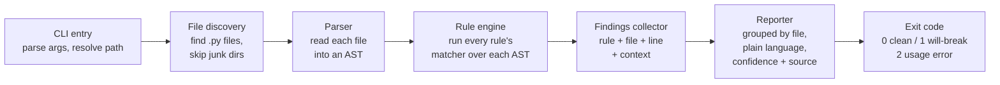

# HLD 001 - The Scan Pipeline

**Status:** Draft - written by Claude at the user's request; open questions at the bottom are for the user to challenge before this is treated as settled.
**Links:** `docs/PRD.md` sections 4, 4.1, 8. Scope contract in `NOTES.md`.
**Last updated:** 2026-07-14

This document describes how the tool is put together at the architecture level.
It deliberately contains no code - behavior and responsibilities only, per this project's `CLAUDE.md`.

## Glossary for this doc

- **AST (Abstract Syntax Tree):** a tree-shaped map of a program's code that a computer can read, instead of plain text. Python ships a built-in `ast` module that produces this.
- **Rule:** one thing we check for (for example, "old-style session usage"), with an ID, an explanation, a confidence label, and a link to its source.
- **Matcher:** the piece of logic that walks the AST looking for one rule's pattern.
- **Finding:** one concrete hit - "rule R1 matched in file X at line N".
- **Severity:** what we tell the user - "This will break" or "Worth checking".
- **Confidence tier:** how sure we are - Confirmed (official changelog) or Reported (trusted secondary sources). See PRD section 4.1.

## The pipeline, end to end

One run of `mcp-migration-check <path>` flows through six stages, each with one job:

Stage responsibilities:

1. **CLI entry.**
   Accepts one optional path argument; defaults to the current folder.
   Validates the path exists and is readable; anything else is a usage error, not a crash.
2. **File discovery.**
   Walks the folder for `.py` files.
   Skips folders that are clearly not the user's code: virtualenvs, `site-packages`, hidden folders, caches.
   Rationale: scanning a vendored copy of the MCP SDK itself would drown the report in findings the user can't act on.
3. **Parser.**
   Reads each file into an AST using Python's built-in `ast` module.
   A file that fails to parse is recorded as a warning in the report and skipped - one broken file must never abort the whole scan.
4. **Rule engine.**
   Loads the rule set (see "Rules are data" below) and runs each rule's matcher over each file's AST.
   The engine knows nothing about any individual rule; adding or removing a rule must not require touching the engine.
5. **Findings collector.**
   Each match becomes a finding: rule ID, file, line number, and a short snippet of context.
   Findings also carry everything the reporter needs (severity, confidence, explanation, source link) pulled from the rule's metadata - the reporter never looks rules up itself.
6. **Reporter + exit code.**
   Prints the report grouped by file, in plain language, one finding per entry with its confidence label and source link.
   Ends with a one-line summary (how many "will break", how many "worth checking", how many files skipped).
   Exit code: 0 when no "will break" findings, 1 when at least one exists, 2 for usage errors.
   This is what makes the tool usable in automated checks later without building that integration now.

## Rules are data, matchers are small code

This is the one piece of extensibility the PRD asks for, and the only one we build.

- Every rule's **metadata** lives in one dedicated rules file, separate from the engine: ID, short title, severity ("will break" / "worth checking"), confidence tier (Confirmed / Reported), plain-language explanation, source URL, and the date the source was last checked.
- Every rule's **matcher** is a small piece of logic registered under the same rule ID.
  Matchers are code because AST pattern-matching genuinely needs logic; pretending otherwise leads to inventing a mini-language (see rejected alternatives).
- The contract: engine hands a matcher one file's AST, the matcher hands back zero or more raw matches (line + context). Everything shown to the user comes from metadata, not from the matcher.

Why this split matters: when the final spec publishes on July 28, updating the tool means editing the rules file (and possibly matcher logic for changed patterns) - not rewriting the pipeline.
It also makes the confidence-tier honesty auditable: every claim the tool prints traces to one row of metadata with a source link.

## The five MVP rules

| ID | What it looks for | Severity | Confidence |
|---|---|---|---|
| R1 | Old-style session usage (reading/storing a session ID) | This will break | Confirmed |
| R2 | Server memory keyed to a session instead of an explicit visible handle | This will break | Confirmed |
| R3 | Web-exposed server code missing the two new required request fields; skipped when the server is local-only (stdio) | This will break | Confirmed |
| R4 | Use of Roots / Sampling / Logging (being phased out) | Worth checking | Reported |
| R5 | Hand-written MCP error numbers | Worth checking | Reported |

Exactly which AST patterns each rule matches (and deliberately ignores) is low-level design, worked out per-rule in the LLD issues - the user proposes those, per `CLAUDE.md` section 2.
R3 needs one extra decision at LLD time: how the tool decides a server is web-exposed vs local-only (likely from which transport the code sets up), and what to do when it can't tell.

## Testing strategy

Three layers, smallest first:

1. **Per-rule unit tests.**
   Every rule gets at least one fixture file that must produce a finding and one that must not.
   The must-not fixtures are the important half - they're what keeps the tool from crying wolf (PRD section 12).
2. **The before/after example as a living test.**
   `examples/` holds a small old-style server and its migrated version.
   These double as documentation (the PRD's required real example) and as test inputs.
3. **An end-to-end check tool.**
   A small script that runs the installed CLI against both example servers, compares the actual report and exit code against an expected snapshot, and fails loudly on any difference.
   This is the "small other tool for end-to-end testing": it tests the tool the way a real user runs it (installed, from a terminal, against real files), not by importing internals.
   It also becomes the release gate - the weekend release only happens when this passes from a clean checkout.

## Rejected alternatives, and why

- **Plain text/regex search instead of AST.**
  Rejected: too many false positives (a comment mentioning "session" is not session usage), and false positives destroy trust fastest (PRD section 12).
- **Running the server to observe behavior (dynamic analysis).**
  Rejected in the PRD: handling other people's credentials, dependencies, and side effects is far beyond a 10-hour budget, and unsafe.
- **A fully declarative rule format (patterns described in a config language, no matcher code).**
  Rejected: it means inventing and maintaining a pattern mini-language, which is a bigger project than this whole tool. Metadata-as-data plus small code matchers gives the July-28 updateability we need at a fraction of the cost.
- **A plugin system for third-party rules.**
  Rejected: the repo rules explicitly forbid premature platforms. Anyone can send a PR to the rules file instead.
- **Cross-file / whole-program analysis (tracking state across modules).**
  Rejected for v1: single-file analysis catches the patterns we know about; deeper analysis is a future-path item. We accept some misses and stay honest about confidence instead.
- **Scanning non-Python or non-official-SDK code.**
  Rejected per the PRD: one language, one SDK, done well.

## Open questions for the user (settle in LLD issues, not here)

1. R3's web-vs-local detection: which signal do we trust, and what does the report say when the tool can't tell?
2. What exact context does a finding carry - just the line, or the source line's text too? (Affects fixture snapshots.)
3. Should parse-failure warnings affect the exit code? (Current proposal: no - they're reported but don't fail the run.)
4. Package layout and tooling choices (test runner, linter) - implementer's call, inside the "boring, well-known" rule from the root `CLAUDE.md`.
