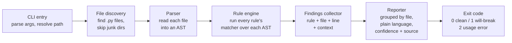

# HLD 001 - The Scan Pipeline

**Status:** Settled - all four open questions below have a recorded decision.
**Links:** `docs/PRD.md` sections 4, 4.1, 8. Scope contract in `NOTES.md`.
**Last updated:** 2026-07-14

This document describes how the tool is put together at the architecture level.
It deliberately contains no code - behavior and responsibilities only, per this project's `CLAUDE.md`.

## Glossary for this doc

- **AST (Abstract Syntax Tree):** a tree-shaped map of a program's code that a computer can read, instead of plain text. Python ships a built-in `ast` module that produces this.
- **Rule:** one thing we check for (for example, "old-style session usage"), with an ID, an explanation, a confidence label, and a link to its source.
- **Matcher:** the piece of logic that walks the AST looking for one rule's pattern.
- **Finding:** one concrete hit - "rule R1 matched in file X at line N".
- **Severity:** what we tell the user - "This will break" or "Worth checking".
- **Confidence tier:** how sure we are - Confirmed (official changelog) or Reported (trusted secondary sources). See PRD section 4.1.

## The pipeline, end to end

One run of `mcp-migration-check <path>` flows through six stages, each with one job:

Stage responsibilities:

1. **CLI entry.**
   Accepts one optional path argument; defaults to the current folder.
   Validates the path exists and is readable; anything else is a usage error, not a crash.
2. **File discovery.**
   Walks the folder for `.py` files.
   Skips folders that are clearly not the user's code: virtualenvs, `site-packages`, hidden folders, caches.
   Rationale: scanning a vendored copy of the MCP SDK itself would drown the report in findings the user can't act on.
3. **Parser.**
   Reads each file into an AST using Python's built-in `ast` module.
   A file that fails to parse is recorded as a warning in the report and skipped - one broken file must never abort the whole scan.
   Parse-failure warnings do not affect the exit code: a file the tool can't read isn't a "will break" finding, it's a gap in what the tool could check, and shouldn't fail a build any differently than a clean scan would.
4. **Rule engine.**
   Loads the rule set (see "Rules are data" below) and runs each rule's matcher over each file's AST.
   The engine knows nothing about any individual rule; adding or removing a rule must not require touching the engine.
5. **Findings collector.**
   Each match becomes a finding: rule ID, file, line number, and the matched source line's own text (stripped of leading/trailing whitespace) - one line, not a multi-line block. A single line is enough for a reader to recognize the match without opening the file, and it keeps fixture snapshots stable: a one-line string only changes when the matched line itself changes, where a surrounding multi-line block would also drift on unrelated formatting elsewhere in the fixture.
   Findings also carry everything the reporter needs (severity, confidence, explanation, source link) pulled from the rule's metadata - the reporter never looks rules up itself.
6. **Reporter + exit code.**
   Prints the report grouped by file, in plain language, one finding per entry with its confidence label and source link.
   A finding can also come back in a fourth state, `NEEDS-MANUAL-CHECK` - "we can't tell whether this rule applies to you, verify by hand." This is not a confidence label (it says nothing about whether the rule itself is real) and not a severity (it says nothing about whether something is broken) - it is a distinct, visible outcome, shown with its own label, never rendered next to "worth checking" so a reader can't mistake it for the Reported tier.
   Ends with a one-line summary: how many "will break", how many "worth checking", how many `NEEDS-MANUAL-CHECK`, how many files skipped - each counted separately.
   Exit code: 0 when no "will break" findings, 1 when at least one exists, 2 for usage errors. `NEEDS-MANUAL-CHECK` findings never contribute to the exit code - the tool isn't asserting breakage, so it must not fail a build over an unresolved applicability question.
   This is what makes the tool usable in automated checks later without building that integration now.

## Rules are data, matchers are small code

This is the one piece of extensibility the PRD asks for, and the only one we build.

- Every rule's **metadata** lives in one dedicated rules file, separate from the engine: ID, short title, severity ("will break" / "worth checking"), confidence tier (Confirmed / Reported), plain-language explanation, source URL, and the date the source was last checked.
- Every rule's **matcher** is a small piece of logic registered under the same rule ID.
  Matchers are code because AST pattern-matching genuinely needs logic; pretending otherwise leads to inventing a mini-language (see rejected alternatives).
- The contract: engine hands a matcher one file's AST, the matcher hands back zero or more raw matches (line + context). Everything shown to the user comes from metadata, not from the matcher.

Why this split matters: when the final spec publishes on July 28, updating the tool means editing the rules file (and possibly matcher logic for changed patterns) - not rewriting the pipeline.
It also makes the confidence-tier honesty auditable: every claim the tool prints traces to one row of metadata with a source link.

## The five MVP rules

| ID | What it looks for | Severity | Confidence |
|---|---|---|---|
| R1 | Old-style session usage (reading/storing a session ID) | This will break | Confirmed |
| R2 | Server memory keyed to a session instead of an explicit visible handle | This will break | Confirmed |
| R3 | Web-exposed server code missing the two new required headers, `Mcp-Method` and `Mcp-Name`; skipped when the server is local-only (stdio) | This will break | Confirmed |
| R4 | Use of Roots / Sampling / Logging (being phased out) | Worth checking | Reported |
| R5 | Hand-written MCP error numbers | Worth checking | Reported |

Exactly which AST patterns each rule matches (and deliberately ignores) is low-level design, worked out per-rule in the LLD issues - the user proposes those, per `CLAUDE.md` section 2.

### R3: transport detection and the "can't tell" case

R3 is the one conditional rule, and it resolves to one of three outcomes, not two:

1. **Confidently web-exposed, headers not handled** -> "This will break" (Confirmed).
2. **Confidently local-only (stdio)** -> suppressed silently. This rule genuinely does not apply, so silence here is correct, not a miss.
3. **Can't tell** -> `NEEDS-MANUAL-CHECK`. Neither silence nor a forced BREAKING/OK verdict is honest here (see the reporter contract above and PRD section 4.1).

The governing principle: **R3 only fires "This will break" when the tool is confident the server is web-exposed.** Confidence, not mere plausibility, is the bar - a weak signal alone must never promote a finding to BREAKING.

Detection checks signals in this order, strongest first:

1. **A literal transport value at the server's run call site** (e.g. an explicit transport argument naming stdio or Streamable HTTP). Directly readable from the AST - the strongest signal.
2. **Absence of an explicit transport value**, in SDK usage where the default transport is stdio. Treated as a stdio signal, not as "can't tell" - a missing argument that defaults to stdio is still information.
3. **Lower-level SDK wiring** - which transport-specific server construct the code sets up (stdio-style vs. Streamable-HTTP-style). A medium-strength signal: present more often than a literal argument, less certain than one.
4. **Bare imports** of a web framework or transport module (e.g. a web server library alongside the MCP SDK) used alone. The weakest signal - a codebase can import such a thing for unrelated reasons - and must never, by itself, promote R3 to "This will break." It may only support an already-medium-strength signal from #3, or otherwise leaves the tool in the "can't tell" case.

None of these signals fires when the transport is decided purely at runtime (a CLI flag, an environment variable, a config file read at startup) - that case is exactly what "can't tell" exists for, since no amount of static reading resolves it.

**Open prerequisite, tracked separately (not yet resolved by this doc):** `Mcp-Method`/`Mcp-Name` are transport-layer HTTP headers. If the official MCP Python SDK's Streamable HTTP transport emits and validates them internally, a server built on an up-to-date SDK may comply automatically with no pattern in the *application* code to match on. Whether R3 has a real app-code target at all - or must be narrowed to hand-rolled/custom transport wiring only - is a dedicated LLD investigation (see GitHub issue tracking; this must be answered before R3 ships as Confirmed/"This will break").

## Testing strategy

Three layers, smallest first:

1. **Per-rule unit tests.**
   Every rule gets at least one fixture file that must produce a finding and one that must not.
   The must-not fixtures are the important half - they're what keeps the tool from crying wolf (PRD section 12).
2. **The before/after example as a living test.**
   `examples/` holds a small old-style server and its migrated version.
   These double as documentation (the PRD's required real example) and as test inputs.
3. **An end-to-end check tool.**
   A small script that runs the installed CLI against both example servers, compares the actual report and exit code against an expected snapshot, and fails loudly on any difference.
   This is the "small other tool for end-to-end testing": it tests the tool the way a real user runs it (installed, from a terminal, against real files), not by importing internals.
   It also becomes the release gate - the weekend release only happens when this passes from a clean checkout.

## Rejected alternatives, and why

- **Plain text/regex search instead of AST.**
  Rejected: too many false positives (a comment mentioning "session" is not session usage), and false positives destroy trust fastest (PRD section 12).
- **Running the server to observe behavior (dynamic analysis).**
  Rejected in the PRD: handling other people's credentials, dependencies, and side effects is far beyond a 10-hour budget, and unsafe.
- **A fully declarative rule format (patterns described in a config language, no matcher code).**
  Rejected: it means inventing and maintaining a pattern mini-language, which is a bigger project than this whole tool. Metadata-as-data plus small code matchers gives the July-28 updateability we need at a fraction of the cost.
- **A plugin system for third-party rules.**
  Rejected: the repo rules explicitly forbid premature platforms. Anyone can send a PR to the rules file instead.
- **Cross-file / whole-program analysis (tracking state across modules).**
  Rejected for v1: single-file analysis catches the patterns we know about; deeper analysis is a future-path item. We accept some misses and stay honest about confidence instead.
- **Scanning non-Python or non-official-SDK code.**
  Rejected per the PRD: one language, one SDK, done well.

## Decisions on the four open questions (all settled)

1. ~~R3's web-vs-local detection: which signal do we trust, and what does the report say when the tool can't tell?~~ Settled: signal order, the confident-web-only firing rule, and the `NEEDS-MANUAL-CHECK` outcome - see the "R3: transport detection and the 'can't tell' case" section above. The one piece still open is a dedicated LLD investigation into whether R3 has a matchable app-code pattern at all, given `Mcp-Method`/`Mcp-Name` are transport-layer headers - tracked as GitHub issue #20, not as an open question in this doc.
2. ~~What exact context does a finding carry?~~ Settled: rule ID, file, line number, and the matched source line's own text (single line, not a multi-line block) - see the "Findings collector" stage above, including why a single line keeps fixture snapshots stable.
3. ~~Should parse-failure warnings affect the exit code?~~ Settled: no. They're reported in the output but never change the exit code - see the "Parser" stage above.
4. ~~Package layout and tooling choices.~~ Settled below.

### Tooling choices (question 4)

Recommendation: pick the tools that are already the boring, unglamorous default in real production Python codebases, rather than either inventing something bespoke or reaching for heavier process apparatus that's about team scale, not code quality. Concretely:

- **Package layout:** a `src/`-layout package (`src/mcp_migration_check/...`). This is the standard layout recommended by the Python Packaging Authority specifically because it stops a developer's working directory from accidentally shadowing the installed package during testing - a real, if easy to miss, class of bug.
- **Packaging metadata:** a single `pyproject.toml` (PEP 621), no separate `setup.py`/`setup.cfg`. Build backend: **hatchling** - PyPA's current recommended default for a package this shape, with less boilerplate than setuptools for a simple single-command CLI.
- **CLI entry point:** `[project.scripts]` in `pyproject.toml`, mapping the `mcp-migration-check` command (PRD section 8) directly to the package's entry function. No hand-rolled `sys.argv` wiring needed for this part.
- **Test runner: `pytest`.** The unambiguous standard; its fixture and parametrization support map directly onto this project's own per-rule fixture convention (see "Testing strategy" below) without extra glue code.
- **Linter + formatter: `ruff`.** One fast tool, one config block, replacing what used to take three separate tools (flake8 + isort + black). It's become the default lint/format choice across both open-source and production Python codebases, which is exactly the "boring, well-known" bar this project holds itself to - not because it's new, but because it's already what a stranger reading this code in six months would expect to see.
- **Type checking: `mypy`, default (non-strict) mode.** Recommended, not required. The rule engine's matchers do a lot of `isinstance` checks against specific `ast` node types (`ast.Call`, `ast.Attribute`, and so on) - exactly the kind of code where a wrong assumption about a node's shape fails silently at runtime instead of loudly. A light type-checking pass catches a real slice of that class of bug for very little setup cost. If hours run short, this rides on the same cut-order as CI (issue #15) rather than needing its own issue.
- **Deliberately not added:** a pre-commit-hook framework, a multi-Python-version test matrix (tox/nox), automated semantic-release/versioning, or a security scanner (e.g. bandit). These are real enterprise practices, but they're about coordinating a team over time, not about whether this tool's five rules work correctly - and they cost setup time disproportionate to a solo 10-hour build. They're recorded instead in `docs/FUTURE-UPGRADES.md` (the "guardrail while a team keeps writing new code" idea already in PRD section 7), for if this project ever grows past one contributor.
